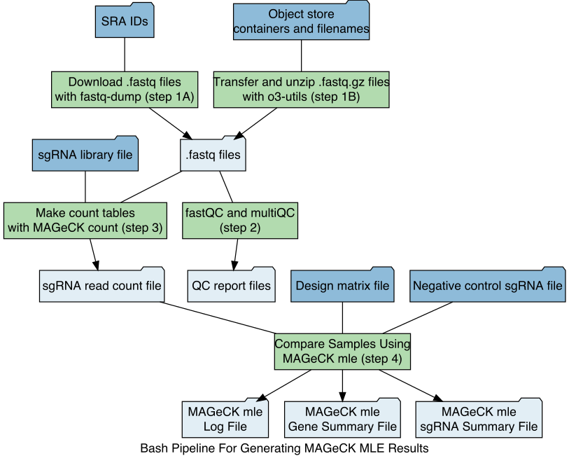

```{r setup, include = FALSE}
knitr::opts_chunk$set(
  collapse = TRUE,
  comment = "#>"
)
```


-------

# General Flow


-------

# Vignettes

- [Vignette 1:  Download fastq files from SRA and run MAGeCK Counts and MLE](Vignettes/CRISPRScreenAnalysis_vignette1.md)
- [Vignette 2:  Get fastq files from object store and SRA and make Counts table](Vignettes/CRISPRScreenAnalysis_vignette2.md)
- [Vignette 3:  Run MAGeCK MLE with Counts and Design Matrix](Vignettes/CRISPRScreenAnalysis_vignette3.md)
- [Vignette 4:  Plot Beta Scores from Gene Summary](Vignettes/CRISPRScreenAnalysis_vignette4.md)

-------

# Pipeline Bash Script

The script CRISPRScreenAnalysisWrapper_verXX.sh is to run the MAGeCK pipeline on
specified fastq files. If specified, it will also download fastq files from SRA
or the object store to a specified directory. The usage is describe below.

### Usage:
```
  Usage: ./CRISPRScreenAnalysisWrapper_verXX.sh 
            [ -o Object_store_paths ]
            [ -s SRA_IDs ]
            [ -b sample_labels ]
            [ -q fastq_filenames ] 
            [ -f fastq_directory ] 
            [ -l sgRNA_library_file ]
            [ -i sample_index_file ]
            [ -d design_matrix_file ]
            [ -n negative_control_sgRNA_file ]

  Note:  
        When multiple arguments are provided for a single option, they must
        all be enclosed in a set of single quotes. For example:
        -s 'SRR4880321 SRR4880322'
```
[CRISPRScreenAnalysisWrapperPairedEnd_ver01.sh](Scripts/CRISPRScreenAnalysisWrapperPairedEnd_ver01.sh)

#### Arguments

| **option flag** | **variable name**              | **description**                                                                                                                                                                                                                                                                                                                                                 |
|-----------------|--------------------------------|-----------------------------------------------------------------------------------------------------------------------------------------------------------------------------------------------------------------------------------------------------------------------------------------------------------------------------------------------------------------|
| -o              | Object\_store\_paths           | Full path of any fastq.gz files that must be transferred from the object store                                                                                                                                                                                                                                                                                  |
| -s              | SRA\_IDs                       | SRR IDs for any fastq files to transfer from SRA using fastq-dump                                                                                                                                                                                                                                                                                               |
| -b              | sample\_labels                 | Labels of samples. These will be the column headers for the counts table. Sample labels must be separated by commas, and they must be in the same order as the fastq\_filenames. A single sample label should be given for technical replicates (ie fastq files separated by commas in "-q fastq\_filenames"). |
| -q              | fastq\_filenames               | Filenames of fastq files. These should be listed in the same oder as the sample\_labels. Fastq filenames must be separated by spaces unless they are technical replicates. Technical replicates, which will be analyzed as one sample, should be separated by commas. A single sample label will be given for technical replicates.                             |
| -f              | fastq\_directory               | Optional directory where fastq files will be stored. This option should not be used unless the user wants to store the files locally. The default and preferred is to store the fastq files in scratch space.                                                                                                                                                   |
| -l              | sgRNA\_library\_file           | Name of the required sgRNA library file. See the MAGeCK documentation for details. This file must be stored in the working directory.                                                                                                                                                                                                                           |
| -d              | design\_matrix\_file           | Name of the required design matrix file. See the MAGeCK documentation for details. This file must be stored in the working directory.                                                                                                                                                                                                                           |
| -n              | negative\_control\_sgRNA\_file | Name of the required negative control file. See the MAGeCK documentation for details. This file must be stored in the working directory.                                                                                                                                                                                                                        |

# Example 1:  

## Download fastq files from SRA and run MAGeCK count and mle
| **sample\_labels**      | **fastq\_filenames**                                  |
|-------------------------|-------------------------------------------------------|
| Day0                    | SRR10852434.fastq,SRR10852437.fastq,SRR10852440.fastq |
| MOLM-13.DMSO\_1         | SRR10852435.fastq                                     |
| MOLM-13.DMSO\_2         | SRR10852438.fastq                                     |
| MOLM-13.DMSO\_3         | SRR10852441.fastq                                     |
| MOLM-13.Midostaurin\_3  | SRR10852443.fastq                                     |
| MOLM-13.Midostaurin\_4  | SRR10852447.fastq                                     |
| MOLM-13.Midostaurin\_5  | SRR10852450.fastq                                     |
| MOLM-13.Gilteritinib\_1 | SRR10852436.fastq                                     |
| MOLM-13.Gilteritinib\_2 | SRR10852439.fastq                                     |
| MOLM-13.Gilteritinib\_3 | SRR10852442.fastq                                     |

## Design matrix
| Samples                | baseline | DMSO | Gilteritinib | Midostaurin |
|------------------------|----------|------|--------------|-------------|
| Day0                   | 1        | 0    | 0            | 0           |
| MOLM-13.DMSO_1         | 1        | 1    | 0            | 0           |
| MOLM-13.DMSO_2         | 1        | 1    | 0            | 0           |
| MOLM-13.DMSO_3         | 1        | 1    | 0            | 0           |
| MOLM-13.Midostaurin_3  | 1        | 0    | 0            | 1           |
| MOLM-13.Midostaurin_4  | 1        | 0    | 0            | 1           |
| MOLM-13.Midostaurin_5  | 1        | 0    | 0            | 1           |
| MOLM-13.Gilteritinib_1 | 1        | 0    | 1            | 0           |
| MOLM-13.Gilteritinib_2 | 1        | 0    | 1            | 0           |
| MOLM-13.Gilteritinib_3 | 1        | 0    | 1            | 0           |

[Example design matrix file](Vignettes/vignette1Data/MolmDesignMatrix.txt)

#### For the "-s" (SRA IDs) option:
```{bash,eval=F}
-s 'SRR10852434 SRR10852437 SRR10852440 SRR10852435 SRR10852438 SRR10852441 \
SRR10852443 SRR10852447 SRR10852450 SRR10852436 SRR10852439 SRR10852442'
```

#### For the "-b" (sample labels) option:
```{bash,eval=F}
-b 'Day0,MOLM-13.DMSO_1,MOLM-13.DMSO_2,MOLM-13.DMSO_3,MOLM-13.Midostaurin_3,\
MOLM-13.Midostaurin_4,MOLM-13.Midostaurin_5,MOLM-13.Gilteritinib_1,\
MOLM-13.Gilteritinib_2,MOLM-13.Gilteritinib_3'
```

#### For the "-q" (fastq filenames) option:
```{bash,eval=F}
-q 'SRR10852434.fastq,SRR10852437.fastq,SRR10852440.fastq SRR10852435.fastq \
SRR10852438.fastq SRR10852441.fastq SRR10852443.fastq SRR10852447.fastq \
SRR10852450.fastq SRR10852436.fastq SRR10852439.fastq SRR10852442.fastq'
```

## Counts Tables Generation
#### sbatch --wrap command (through generating count tables):
```{bash,eval=F}
sbatch \
--output slurm-%x.%A.%a.log \
--mail-type END,FAIL,ARRAY_TASKS \
--mem 96 \
--cpus-per-task 12 \
-p serial \
--wrap=\
"/Volumes/Sansam/hpc-nobackup/scripts/CRISPRScreenAnalysisWrapper_ver01.sh \
-s 'SRR10852434 SRR10852437 SRR10852440 SRR10852435 SRR10852438 SRR10852441 \
SRR10852443 SRR10852447 SRR10852450 SRR10852436 SRR10852439 SRR10852442' \
-b 'Day0,MOLM-13.DMSO_1,MOLM-13.DMSO_2,MOLM-13.DMSO_3,MOLM-13.Midostaurin_3,\
MOLM-13.Midostaurin_4,MOLM-13.Midostaurin_5,MOLM-13.Gilteritinib_1,\
MOLM-13.Gilteritinib_2,MOLM-13.Gilteritinib_3' \
-q 'SRR10852434.fastq,SRR10852437.fastq,SRR10852440.fastq SRR10852435.fastq \
SRR10852438.fastq SRR10852441.fastq SRR10852443.fastq SRR10852447.fastq \
SRR10852450.fastq SRR10852436.fastq SRR10852439.fastq SRR10852442.fastq' \
-l broadgpp-brunello-library-corrected.txt"
```

## Run MAGeCK MLE
#### sbatch --wrap command (MAGeCK mle with pre-generated count table):
```{bash,eval=F}
sbatch \
--output slurm-%x.%A.%a.log \
--mail-type END,FAIL,ARRAY_TASKS \
--mem 96 \
--cpus-per-task 12 \
-p serial \
--wrap=\
"/Volumes/Sansam/hpc-nobackup/scripts/CRISPRScreenAnalysisWrapper_ver01.sh \
-d MolmDesignMatrix.txt \
-n brunello_nonTargeting.txt"
```

#### Entire sbatch --wrap command (all steps through MAGeCK mle):
```{bash,eval=F}
sbatch \
--output slurm-%x.%A.%a.log \
--mail-type END,FAIL,ARRAY_TASKS \
--mem 96 \
--cpus-per-task 12 \
-p serial \
--wrap=\
"/Volumes/Sansam/hpc-nobackup/scripts/CRISPRScreenAnalysisWrapper_ver01.sh \
-s 'SRR10852434 SRR10852437 SRR10852440 SRR10852435 SRR10852438 SRR10852441 \
SRR10852443 SRR10852447 SRR10852450 SRR10852436 SRR10852439 SRR10852442' \
-b 'Day0,MOLM-13.DMSO_1,MOLM-13.DMSO_2,MOLM-13.DMSO_3,MOLM-13.Midostaurin_3,\
MOLM-13.Midostaurin_4,MOLM-13.Midostaurin_5,MOLM-13.Gilteritinib_1,\
MOLM-13.Gilteritinib_2,MOLM-13.Gilteritinib_3' \
-q 'SRR10852434.fastq,SRR10852437.fastq,SRR10852440.fastq SRR10852435.fastq \
SRR10852438.fastq SRR10852441.fastq SRR10852443.fastq SRR10852447.fastq \
SRR10852450.fastq SRR10852436.fastq SRR10852439.fastq SRR10852442.fastq' \
-l broadgpp-brunello-library-corrected.txt \
-d MolmDesignMatrix.txt\
-n brunello_nonTargeting.txt"
```

## Example 1: Input files (see vignette 1):
1. [CRISPRScreenAnalysisWrapperPairedEnd_ver01.sh](Scripts/CRISPRScreenAnalysisWrapperPairedEnd_ver01.sh)
2. [sgRNA library file](Vignettes/vignette1Data/broadgpp-brunello-library-corrected.txt)  
3. [Negative control sgRNA file](Vignettes/vignette1Data/brunello_nonTargeting.txt)  
4. [Design matrix](Vignettes/vignette1Data/MolmDesignMatrix.txt)

## Example 1: Output
1. MAGeCK Count  
- [sample1_countsummary.R](Vignettes/vignette1Data/sample1_countsummary.R)  
- [sample1_countsummary.Rnw](Vignettes/vignette1Data/sample1_countsummary.Rnw)  
- [sample1.count_normalized.txt](Vignettes/vignette1Data/sample1.count_normalized.txt)  
- [sample1.count.txt](Vignettes/vignette1Data/sample1.count.txt)  
- [sample1.countsummary.txt](Vignettes/vignette1Data/sample1.countsummary.txt)  
2. MAGeCK MLE  
- [sample1.gene_summary.txt](Vignettes/vignette3Data/sample1.gene_summary.txt)  
- [sample1.sgrna_summary.txt](Vignettes/vignette3Data/sample1.sgrna_summary.txt)  
3. [multiQC Report](Vignettes/vignette1Data/fastqc_results/multiqc_results/multiqc_report.html)  


### Example 2:  Get fastq files from object store and SRA and make count table

```{bash,eval=F}
sbatch \
--output slurm-%x.%A.%a.log \
--mail-type END,FAIL,ARRAY_TASKS \
--mem 96 \
--cpus-per-task 12 \
-p serial \
--wrap=\
"/Volumes/Sansam/hpc-nobackup/scripts/CRISPRScreenAnalysisWrapper_ver01.sh \
-o 'o3://LDAP_o3-sansamc/2020/2020Mar19_TDN_CRISPRLibraryPreps/brunello_TNscreen_S32_R1_001.fastq.gz' \
-s 'SRR8983579 SRR6737232 SRR8297998' \
-b 'Sansam_Brunello_lentiguide,SRR8983579_Brunello_lentiguide,\
SRR6737232_Brunello_lentiguide,SRR8297998_Brunello_lentiguide' \
-q 'brunello_TNscreen_S32_R1_001.fastq SRR8983579.fastq \
SRR6737232.fastq SRR8297998.fastq' \
-l broadgpp-brunello-library-corrected.txt"
```


# Possible Outcomes from Hits

## Supressors


## Enhancers


# Follow up Hits

## Individual Guide Assays

Measure the IC50 of cells expressing one guide and see if the IC50 shifts. Also we can measure how much the cells
grow when in different concentrations of Auxin. This will allow to to determine if hits are "real" or not. 


