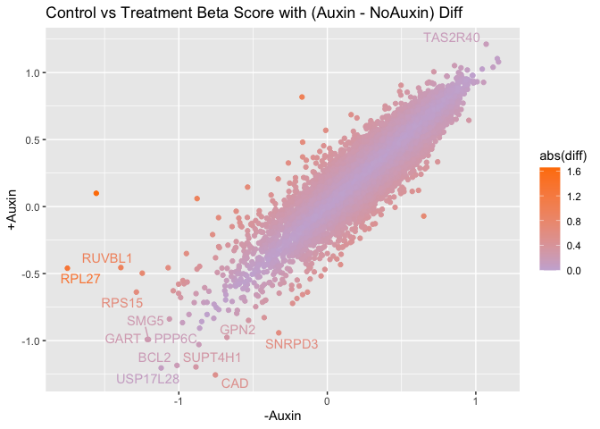

Vignette 4: Plotting Summary Data
================
Kevin Boyd
2022-05-09


# Introduction

This rmarkdown file is for finding a list of top hits from a CRISPR
screen. I load the data, pull out beta scores, combine the FDR generated
in a separate MLE, determine normalization method, plot the data, and
filter the results for Q-value \> -0.25. The result is a list of 10
genes possibly important to follow up. I also made ranked lists of the
highest and lowest differences in beta score.

# Load Libraries

``` r
library(MAGeCKFlute)
library(plotly)
library(RColorBrewer)
library(htmlwidgets)
library(cowplot)
library(tidyverse)
library(ggrepel)
```

# Load the data

``` r
Replicates <- read.table("~/Dropbox (OMRF)/Github/CRISPRScreenAnalysis/Vignettes/vignette4Data/2022March23_All_CDC45_Day9.gene_summary.txt" , header = T)
```

# Look at the Data

``` r
head(Replicates)
#>      Gene sgRNA NoAuxin.beta NoAuxin.z NoAuxin.p.value NoAuxin.fdr
#> 1 CABLES2     4    0.0934630  0.808330         0.25114     0.78989
#> 2  OR52E6     4   -0.0092210 -0.055357         0.69790     0.95484
#> 3   ZC3H8     4   -0.4070400 -1.815500         0.15597     0.72372
#> 4   CLDN4     4    0.0135090  0.171370         0.58751     0.92051
#> 5    PPAN     4   -0.4603700 -2.317100         0.10925     0.66847
#> 6 ZDHHC12     4    0.0080667  0.059862         0.61335     0.92870
#>   NoAuxin.wald.p.value NoAuxin.wald.fdr Auxin.beta  Auxin.z Auxin.p.value
#> 1             0.418900          0.91460   0.198730  1.71820       0.30560
#> 2             0.955850          0.99788   0.126040  0.75675       0.53806
#> 3             0.069451          0.42464  -0.129660 -0.57843       0.53806
#> 4             0.863930          0.99446   0.057311  0.72695       0.80270
#> 5             0.020498          0.20631  -0.145940 -0.73591       0.49527
#> 6             0.952270          0.99705   0.186170  1.38150       0.34040
#>   Auxin.fdr Auxin.wald.p.value Auxin.wald.fdr May5.beta   May5.z May5.p.value
#> 1   0.87316           0.085752        0.54207 -0.013050 -0.12110     0.994920
#> 2   0.93914           0.449200        0.75623  0.281660  1.82100     0.099618
#> 3   0.93914           0.562970        0.81417 -0.129970 -0.62170     0.488670
#> 4   0.97523           0.467260        0.76569  0.019872  0.27137     0.847070
#> 5   0.92467           0.461780        0.76291 -0.049632 -0.26662     0.825350
#> 6   0.87980           0.167140        0.60122 -0.090114 -0.71774     0.646990
#>   May5.fdr May5.wald.p.value May5.wald.fdr May19.beta  May19.z May19.p.value
#> 1  0.99921           0.90361       0.98876   0.156170  1.45250      0.189240
#> 2  0.85816           0.06861       0.71615  -0.184540 -1.19290      0.379170
#> 3  0.96923           0.53414       0.90554  -0.041172 -0.19746      0.987130
#> 4  0.99197           0.78610       0.96912  -0.024687 -0.33721      0.929050
#> 5  0.98903           0.78976       0.97012  -0.406790 -2.18430      0.042275
#> 6  0.98179           0.47291       0.88432   0.135450  1.08100      0.239050
#>   May19.fdr May19.wald.p.value May19.wald.fdr Nov23_rep1.beta Nov23_rep1.z
#> 1   0.87784           0.146360        0.82991        0.074554      0.69155
#> 2   0.93667           0.232890        0.88194        0.130900      0.84605
#> 3   0.99879           0.843470        0.99151       -0.172560     -0.82416
#> 4   0.99765           0.735960        0.98401       -0.039685     -0.54183
#> 5   0.68846           0.028943        0.65080        0.057574      0.30915
#> 6   0.89667           0.279710        0.89871        0.150070      1.19560
#>   Nov23_rep1.p.value Nov23_rep1.fdr Nov23_rep1.wald.p.value Nov23_rep1.wald.fdr
#> 1            0.44305        0.94292                 0.48922             0.99944
#> 2            0.24172        0.87922                 0.39753             0.99944
#> 3            0.34762        0.92267                 0.40985             0.99944
#> 4            0.95956        0.99691                 0.58794             0.99944
#> 5            0.51567        0.95007                 0.75721             0.99944
#> 6            0.19045        0.84012                 0.23184             0.99944
#>   Nov23_rep2.beta Nov23_rep2.z Nov23_rep2.p.value Nov23_rep2.fdr
#> 1       0.0745190     0.691360            0.53011        0.95531
#> 2      -0.1112100    -0.718640            0.59326        0.96547
#> 3      -0.1930000    -0.920690            0.30634        0.92148
#> 4       0.1153200     1.575000            0.38210        0.94257
#> 5      -0.2074600    -1.105800            0.26971        0.92148
#> 6      -0.0011592    -0.009228            0.87773        0.99132
#>   Nov23_rep2.wald.p.value Nov23_rep2.wald.fdr
#> 1                 0.48934             0.91760
#> 2                 0.47236             0.91609
#> 3                 0.35721             0.89533
#> 4                 0.11526             0.84083
#> 5                 0.26879             0.87357
#> 6                 0.99264             0.99871
```

# Pull Out Only Beta Scores

``` r
gdata <- ReadBeta(Replicates)
head(gdata)
#>      Gene    NoAuxin     Auxin      May5     May19 Nov23_rep1 Nov23_rep2
#> 1 CABLES2  0.0934630  0.198730 -0.013050  0.156170   0.074554  0.0745190
#> 2  OR52E6 -0.0092210  0.126040  0.281660 -0.184540   0.130900 -0.1112100
#> 3   ZC3H8 -0.4070400 -0.129660 -0.129970 -0.041172  -0.172560 -0.1930000
#> 4   CLDN4  0.0135090  0.057311  0.019872 -0.024687  -0.039685  0.1153200
#> 5    PPAN -0.4603700 -0.145940 -0.049632 -0.406790   0.057574 -0.2074600
#> 6 ZDHHC12  0.0080667  0.186170 -0.090114  0.135450   0.150070 -0.0011592
```

# Set Normalization

``` r
ctrlname = "NoAuxin"
treatname = "Auxin"
gdata_cc = NormalizeBeta(gdata, samples=c(ctrlname, treatname), method="cell_cycle")
head(gdata_cc)
#>      Gene     NoAuxin      Auxin      May5     May19 Nov23_rep1 Nov23_rep2
#> 1 CABLES2  0.14954559  0.4551868 -0.013050  0.156170   0.074554  0.0745190
#> 2  OR52E6 -0.01475407  0.2886919  0.281660 -0.184540   0.130900 -0.1112100
#> 3   ZC3H8 -0.65128484 -0.2969834 -0.129970 -0.041172  -0.172560 -0.1930000
#> 4   CLDN4  0.02161509  0.1312696  0.019872 -0.024687  -0.039685  0.1153200
#> 5    PPAN -0.73661557 -0.3342724 -0.049632 -0.406790   0.057574 -0.2074600
#> 6 ZDHHC12  0.01290713  0.4264184 -0.090114  0.135450   0.150070 -0.0011592
gdata_loe = NormalizeBeta(gdata, samples=c(ctrlname, treatname), method="loess")
head(gdata_loe)
#>      Gene     NoAuxin       Auxin      May5     May19 Nov23_rep1 Nov23_rep2
#> 1 CABLES2  0.15391530  0.13827770 -0.013050  0.156170   0.074554  0.0745190
#> 2  OR52E6  0.03421942  0.08259958  0.281660 -0.184540   0.130900 -0.1112100
#> 3   ZC3H8 -0.37761691 -0.15908309 -0.129970 -0.041172  -0.172560 -0.1930000
#> 4   CLDN4  0.05371550  0.01710450  0.019872 -0.024687  -0.039685  0.1153200
#> 5    PPAN -0.42934316 -0.17696684 -0.049632 -0.406790   0.057574 -0.2074600
#> 6 ZDHHC12  0.05822449  0.13601221 -0.090114  0.135450   0.150070 -0.0011592
```

# Compare Normalized and Non-normalized Data

**Do not normalize. Plots look terrible after cell_cycle normalization**

``` r
#to compare density of the non-normalized betas
p1 <- DensityView(gdata, samples=c(ctrlname, treatname))

#to compare density of the normalized betas
p2 <- DensityView(gdata_cc, samples=c(ctrlname, treatname))

#to compare density of the normalized betas
p3 <- DensityView(gdata_loe, samples=c(ctrlname, treatname))

#plot them side by side
plot_grid(p1, p2, p3, labels = c("NonNormalized","CellCycle","Loess"), nrow = 1)
```

<!-- -->

# Find Positive and Negative Selection

``` r
# choose which normalization
gdata1 <- gdata
gdata1$AuxinFDR <- Replicates$Auxin.fdr
gdata1$NoAuxinFDR <- Replicates$NoAuxin.fdr

#positive and negative selection
gdata1$NoAuxin = rowMeans(gdata1[,ctrlname, drop = FALSE])
gdata1$Auxin = rowMeans(gdata1[,treatname, drop = FALSE])

#make difference column (Treatment - Control)
gdata1$diff <- gdata1$Auxin - gdata1$NoAuxin
```

# Plot Treatment vs Control Beta Scores with Difference Auxin - NoAuxin (Diff)

``` r
#ggplot with nice labels and color scheme
ggplot(data=gdata1,aes(x=NoAuxin,y=Auxin,label=Gene,color=diff))+
  geom_point() +
  xlab("-Auxin") +
  ylab("+Auxin") +
  ggtitle("Control vs Treatment Beta Score with (Auxin - NoAuxin) Diff") +
  scale_colour_gradient(low = "#ff7f00", high = "#7570b3")
```

<!-- -->

# Plot Treatment vs Control Beta Scores with Q-values (FDR)

``` r
#ggplot with nice labels and color scheme
ggplot(data=Replicates,aes(x=NoAuxin.beta,y=Auxin.beta,label=Gene,color=Auxin.fdr))+
  geom_point() +
  xlab("-Auxin") +
  ylab("+Auxin") +
  ggtitle("Control vs Treatment Beta Score with Rep2_vs_Rep1 FDR") +
  scale_colour_gradient(low = "#ff7f00", high = "#7570b3") #+
```

<!-- -->

``` r
#  scale_x_continuous(limits = c(-3, 2.5)) +
#  scale_y_continuous(limits = c(-3, 2.5))
```

# Plot Treatment vs Control Beta Scores with Difference Auxin - NoAuxin (Diff)

``` r
# ggplot with nice labels and color scheme
ggplot(data=gdata1,aes(x=NoAuxin,y=Auxin,label=Gene,color=abs(diff))) +
  geom_point() +
  xlab("-Auxin") +
  ylab("+Auxin") +
  ggtitle("Control vs Treatment Beta Score with (Auxin - NoAuxin) Diff") +
  scale_colour_gradient2(low = "#6a3d9a", mid = "#cab2d6", high = "#ff7f00") +
  geom_text_repel(data=filter(gdata1, AuxinFDR<=0.1), aes(label=Gene))
```

<!-- -->

# Export Plotly Graph

``` r
# Export as a plotly graph
# fig1 <- ggplotly(p2)
# saveWidget(as_widget(fig1), "~/Desktop/ControlvsTreatmentBeta.html")
```

# Lists of Best Genes

## Find all FDR \< 0.1 With an Absolute Difference \> 0.5

``` r
gdata1 %>% filter(AuxinFDR <= 0.01 & diff > 0.5)
#>       Gene    NoAuxin   Auxin    May5     May19 Nov23_rep1 Nov23_rep2 AuxinFDR
#> 1    ITPK1 -0.1235400 1.19430 0.41951  0.067568  0.2711400   0.312500        0
#> 2    KPNA2  0.0499630 0.82251 0.24469 -0.042992  0.4251000   0.245680        0
#> 3     LEO1 -0.0109690 0.82857 0.34183  0.133630  0.2985200   0.043627        0
#> 4    PRDM4  0.0087002 1.31510 0.53333  0.158990  0.1766300   0.454840        0
#> 5     CCNC -0.2686800 0.81444 0.20035  0.171120  0.0371660   0.137130        0
#> 6   MAP2K3 -0.1942500 0.84981 0.11106  0.102370  0.1798900   0.262240        0
#> 7  L3MBTL2  0.3615800 0.96798 0.46126  0.247340  0.4214200   0.199530        0
#> 8     SKP1 -0.6442300 1.35560 0.28049 -0.049982  0.0075599   0.473260        0
#> 9    TCEB3 -0.1901100 0.87395 0.18718 -0.111960  0.2329100   0.375700        0
#> 10   RBM15 -0.0386320 1.74970 0.44675  0.243610  0.5797300   0.441010        0
#> 11     MGA  0.2285800 1.46310 0.41287  0.428130  0.5284700   0.322220        0
#> 12  LARP4B -0.0319860 0.83586 0.17572 -0.157760  0.4874300   0.298480        0
#>    NoAuxinFDR     diff
#> 1     0.97261 1.317840
#> 2     0.87610 0.772547
#> 3     0.95666 0.839539
#> 4     0.92691 1.306400
#> 5     0.85175 1.083120
#> 6     0.91381 1.044060
#> 7     0.11111 0.606400
#> 8     0.45529 1.999830
#> 9     0.91611 1.064060
#> 10    0.97688 1.788332
#> 11    0.40213 1.234520
#> 12    0.97370 0.867846
gdata1 %>% filter(NoAuxinFDR <= 0.01 & diff > 0.5)
#>           Gene NoAuxin    Auxin     May5    May19 Nov23_rep1 Nov23_rep2
#> 1        WASH1 -1.6159 -1.09910 -0.90181 -0.54130   -0.78231  -0.489590
#> 2       ZNHIT2 -1.5210 -0.58746 -0.50254 -0.46394   -1.06860  -0.073345
#> 3        PSMA6 -1.8621 -1.31380 -0.67440 -0.32419   -1.08610  -1.091100
#> 4         XPO1 -1.8361 -0.77318 -0.42391 -0.81138   -1.09690  -0.277070
#> 5 LOC102724862 -1.3162 -0.70781 -0.19025 -0.37607   -0.62415  -0.833580
#>   AuxinFDR NoAuxinFDR    diff
#> 1 0.227270          0 0.51680
#> 2 0.615630          0 0.93354
#> 3 0.052632          0 0.54830
#> 4 0.505020          0 1.06292
#> 5 0.545070          0 0.60839
```

## Top10 Negative Difference (Enhancers)

``` r
Bottom10 <- gdata1[order(gdata1$diff, decreasing = F),]
Bottom10[1:10,]
#>           Gene   NoAuxin    Auxin      May5     May19 Nov23_rep1 Nov23_rep2
#> 18826    MORC2  0.217490 -0.50613  0.149170 -0.194810 -0.2290800 -0.0139150
#> 18910    UNC5C -0.053917 -0.72982 -0.501990 -0.290860  0.0046902  0.0044301
#> 353    FAM208A -0.645560 -1.30000 -0.502960 -0.505540 -0.2648700 -0.6722000
#> 14124 HIST2H3A -0.715080 -1.35270 -0.465220 -0.443910 -0.6935000 -0.4651400
#> 14604     ASB7  0.220040 -0.32321  0.094767 -0.086217 -0.0063414 -0.1053800
#> 16604     SETX -0.230260 -0.77141 -0.222310 -0.584370 -0.1523900 -0.0425980
#> 18331    NUDT1  0.296670 -0.22419  0.105310 -0.011031 -0.0974660  0.0756680
#> 17918   ZNF664 -0.356050 -0.87390 -0.616040 -0.146320 -0.2700900 -0.1975000
#> 14897   SETDB1 -0.157760 -0.66792 -0.121390 -0.224450 -0.2656600 -0.2141700
#> 7908      TAF4  0.019402 -0.49013 -0.040686 -0.266820 -0.1134900 -0.0497300
#>       AuxinFDR NoAuxinFDR      diff
#> 18826 0.700140    0.43670 -0.723620
#> 18910 0.523440    0.98660 -0.675903
#> 353   0.052632    0.45529 -0.654440
#> 14124 0.052632    0.40926 -0.637620
#> 14604 0.807320    0.42396 -0.543250
#> 16604 0.505020    0.88988 -0.541150
#> 18331 0.878280    0.22699 -0.520860
#> 17918 0.386900    0.75988 -0.517850
#> 14897 0.565810    0.94794 -0.510160
#> 7908  0.721870    0.91540 -0.509532
```

## Top10 Positive Difference (Supressors)

``` r
Top10 <- gdata1[order(gdata1$diff, decreasing = T),]
Top10[1:10,]
#>        Gene    NoAuxin     Auxin     May5     May19 Nov23_rep1 Nov23_rep2
#> 11706  SKP1 -0.6442300  1.355600  0.28049 -0.049982  0.0075599    0.47326
#> 16519 RBM15 -0.0386320  1.749700  0.44675  0.243610  0.5797300    0.44101
#> 1779  ITPK1 -0.1235400  1.194300  0.41951  0.067568  0.2711400    0.31250
#> 8959  PRDM4  0.0087002  1.315100  0.53333  0.158990  0.1766300    0.45484
#> 17079   MGA  0.2285800  1.463100  0.41287  0.428130  0.5284700    0.32222
#> 14282 ZMYM4 -0.4397700  0.738610 -0.19366 -0.226340  0.0788510    0.63999
#> 9456   CCNC -0.2686800  0.814440  0.20035  0.171120  0.0371660    0.13713
#> 17172 TICRR -1.0900000 -0.016506 -0.34371 -0.688770 -0.7714800    0.69746
#> 11972 TCEB3 -0.1901100  0.873950  0.18718 -0.111960  0.2329100    0.37570
#> 16538  XPO1 -1.8361000 -0.773180 -0.42391 -0.811380 -1.0969000   -0.27707
#>       AuxinFDR NoAuxinFDR     diff
#> 11706  0.00000    0.45529 1.999830
#> 16519  0.00000    0.97688 1.788332
#> 1779   0.00000    0.97261 1.317840
#> 8959   0.00000    0.92691 1.306400
#> 17079  0.00000    0.40213 1.234520
#> 14282  0.14286    0.69864 1.178380
#> 9456   0.00000    0.85175 1.083120
#> 17172  0.99378    0.11111 1.073494
#> 11972  0.00000    0.91611 1.064060
#> 16538  0.50502    0.00000 1.062920
```
