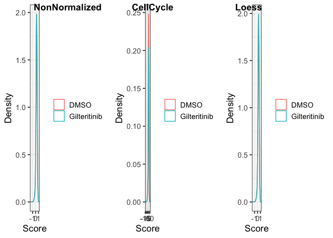
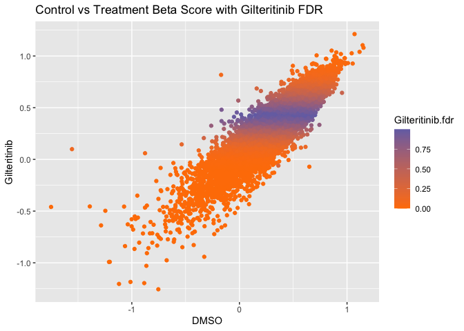

Vignette 4: Plotting Summary Data
================
Kevin Boyd
2022-05-17


# Introduction

This rmarkdown file is for finding a list of top hits from a CRISPR
screen. I load the data, pull out beta scores, combine the FDR generated
in a separate MLE, determine normalization method, plot the data, and
filter the results for Q-value \< 0.01. The result is a list of genes
possibly important to follow up. I also made ranked lists of the highest
and lowest differences in beta score.

# Load Libraries

``` r
library(MAGeCKFlute)
library(plotly)
library(RColorBrewer)
library(htmlwidgets)
library(cowplot)
library(tidyverse)
library(ggrepel)
```

# Load the data

``` r
Replicates <- read.table("~/Dropbox (OMRF)/Github/GenericCRISPRAnalysis/GenericCRISPRanalysis/Vignettes/vignette4Data/sample1.gene_summary.txt" , header = T)
```

# Look at the Data

``` r
head(Replicates)
#>       Gene sgRNA DMSO.beta  DMSO.z DMSO.p.value DMSO.fdr DMSO.wald.p.value
#> 1    DNAH8     4   0.35163 0.65142      0.47606  0.73320           0.51477
#> 2    GATA6     4   0.52365 0.74169      0.59300  0.80911           0.45827
#> 3     CETP     4   0.43637 0.67813      0.92644  0.97340           0.49769
#> 4 C17orf64     4   0.42558 0.78949      0.86470  0.94571           0.42983
#> 5      DR1     4   0.41899 0.46538      0.82520  0.92859           0.64166
#> 6  NFKBIL1     4   0.22698 0.74394      0.10197  0.32592           0.45691
#>   DMSO.wald.fdr Gilteritinib.beta Gilteritinib.z Gilteritinib.p.value
#> 1       0.82585           0.35066        0.65025              0.58395
#> 2       0.82585           0.54351        0.76994              0.41584
#> 3       0.82585           0.47235        0.73498              0.74740
#> 4       0.82585           0.48603        0.90186              0.67797
#> 5       0.82736           0.59370        0.66004              0.25266
#> 6       0.82585           0.16879        0.55347              0.05750
#>   Gilteritinib.fdr Gilteritinib.wald.p.value Gilteritinib.wald.fdr
#> 1          0.81730                   0.51553               0.85002
#> 2          0.70072                   0.44133               0.85002
#> 3          0.90020                   0.46235               0.85002
#> 4          0.86630                   0.36713               0.85002
#> 5          0.54473                   0.50923               0.85002
#> 6          0.23943                   0.57994               0.85002
#>   Midostaurin.beta Midostaurin.z Midostaurin.p.value Midostaurin.fdr
#> 1         0.498120      0.927500          0.01407400        0.163920
#> 2         0.014104      0.019981          0.86208000        0.953090
#> 3         0.694190      1.082500          0.00062784        0.042105
#> 4         0.189640      0.351970          0.41056000        0.719970
#> 5        -0.805980     -0.894610          0.00026160        0.033113
#> 6         0.357640      1.173700          0.08172400        0.359080
#>   Midostaurin.wald.p.value Midostaurin.wald.fdr
#> 1                  0.35367                    1
#> 2                  0.98406                    1
#> 3                  0.27904                    1
#> 4                  0.72486                    1
#> 5                  0.37100                    1
#> 6                  0.24051                    1
```

# Pull Out Only Beta Scores

``` r
gdata <- ReadBeta(Replicates)
head(gdata)
#>       Gene    DMSO Gilteritinib Midostaurin
#> 1    DNAH8 0.35163      0.35066    0.498120
#> 2    GATA6 0.52365      0.54351    0.014104
#> 3     CETP 0.43637      0.47235    0.694190
#> 4 C17orf64 0.42558      0.48603    0.189640
#> 5      DR1 0.41899      0.59370   -0.805980
#> 6  NFKBIL1 0.22698      0.16879    0.357640
```

# Set Normalization

``` r
ctrlname = "DMSO"
treatname = "Gilteritinib"
gdata_cc = NormalizeBeta(gdata, samples=c(ctrlname, treatname), method="cell_cycle")
head(gdata_cc)
#>       Gene     DMSO Gilteritinib Midostaurin
#> 1    DNAH8 2.811578     3.402550    0.498120
#> 2    GATA6 4.187023     5.273826    0.014104
#> 3     CETP 3.489146     4.583341    0.694190
#> 4 C17orf64 3.402871     4.716082    0.189640
#> 5      DR1 3.350178     5.760834   -0.805980
#> 6  NFKBIL1 1.814896     1.637816    0.357640
gdata_loe = NormalizeBeta(gdata, samples=c(ctrlname, treatname), method="loess")
head(gdata_loe)
#>       Gene      DMSO Gilteritinib Midostaurin
#> 1    DNAH8 0.3452823    0.3570077    0.498120
#> 2    GATA6 0.5188582    0.5483018    0.014104
#> 3     CETP 0.4308822    0.4778378    0.694190
#> 4 C17orf64 0.4201072    0.4915028    0.189640
#> 5      DR1 0.4139583    0.5987317   -0.805980
#> 6  NFKBIL1 0.2204320    0.1753380    0.357640
```

# Compare Normalized and Non-normalized Data

**Do not normalize. Plots look terrible after cell_cycle normalization**

``` r
#to compare density of the non-normalized betas
p1 <- DensityView(gdata, samples=c(ctrlname, treatname))

#to compare density of the normalized betas
p2 <- DensityView(gdata_cc, samples=c(ctrlname, treatname))

#to compare density of the normalized betas
p3 <- DensityView(gdata_loe, samples=c(ctrlname, treatname))

#plot them side by side
plot_grid(p1, p2, p3, labels = c("NonNormalized","CellCycle","Loess"), nrow = 1)
```

<!-- -->

# Find Positive and Negative Selection

``` r
# choose which normalization
gdata1 <- gdata
gdata1$GilteritinibFDR <- Replicates$Gilteritinib.fdr
gdata1$MidostaurinFDR <- Replicates$Midostaurin.fdr

#positive and negative selection
gdata1$DMSO = rowMeans(gdata1[,ctrlname, drop = FALSE])
gdata1$Gilteritinib = rowMeans(gdata1[,treatname, drop = FALSE])

#make difference column (Treatment - Control)
gdata1$diff <- gdata1$Gilteritinib - gdata1$DMSO
```

# Plot Treatment vs Control Beta Scores with Difference Auxin - NoAuxin (Diff)

``` r
#ggplot with nice labels and color scheme
ggplot(data=gdata1,aes(x=DMSO,y=Gilteritinib,label=Gene,color=diff))+
  geom_point() +
  xlab("DMSO") +
  ylab("Gilteritinib") +
  ggtitle("Control vs Treatment Beta Score with (Treatment - Control) Diff") +
  scale_colour_gradient(low = "#ff7f00", high = "#7570b3")
```

<!-- -->

# Plot Treatment vs Control Beta Scores with Q-values (FDR)

``` r
#ggplot with nice labels and color scheme
ggplot(data=Replicates,aes(x=DMSO.beta,y=Gilteritinib.beta,label=Gene,color=Gilteritinib.fdr))+
  geom_point() +
  xlab("DMSO") +
  ylab("Gilteritinib") +
  ggtitle("Control vs Treatment Beta Score with Gilteritinib FDR") +
  scale_colour_gradient(low = "#ff7f00", high = "#7570b3") #+
```

<!-- -->

``` r
#  scale_x_continuous(limits = c(-3, 2.5)) +
#  scale_y_continuous(limits = c(-3, 2.5))
```

# Plot Treatment vs Control Beta Scores with Difference Auxin - NoAuxin (Diff)

``` r
# ggplot with nice labels and color scheme
ggplot(data=gdata1,aes(x=DMSO,y=Gilteritinib,label=Gene,color=abs(diff))) +
  geom_point() +
  xlab("-Auxin") +
  ylab("+Auxin") +
  ggtitle("Control vs Treatment Beta Score with (Auxin - NoAuxin) Diff") +
  scale_colour_gradient2(low = "#6a3d9a", mid = "#cab2d6", high = "#ff7f00") +
  geom_text_repel(data=filter(gdata1, GilteritinibFDR<=0.01), aes(label=Gene))
#> Warning: ggrepel: 1065 unlabeled data points (too many overlaps). Consider
#> increasing max.overlaps
```

<!-- -->

# Export Plotly Graph

``` r
# Export as a plotly graph
# fig1 <- ggplotly(p2)
# saveWidget(as_widget(fig1), "~/Desktop/ControlvsTreatmentBeta.html")
```

# Lists of Best Genes

## Find all FDR \< 0.1 With an Absolute Difference \> 0.5

``` r
gdata1 %>% filter(GilteritinibFDR <= 0.01 & diff > 0.5)
#>     Gene     DMSO Gilteritinib Midostaurin GilteritinibFDR MidostaurinFDR
#> 1 CPSF3L -0.59594    -0.086011    0.435120       0.0062370       0.226580
#> 2  RPS15 -1.28590    -0.638130    0.031743       0.0000000       0.983870
#> 3 SNRPA1 -1.07190    -0.456390   -0.627880       0.0000000       0.055769
#> 4  RPL13 -0.73251    -0.082526    0.367920       0.0062370       0.341160
#> 5  RPL27 -1.75040    -0.459910   -0.511220       0.0000000       0.114200
#> 6  RPS24 -1.24620    -0.496940   -0.476360       0.0000000       0.145120
#> 7  DDX47 -0.77241    -0.208910    0.566190       0.0017422       0.106160
#> 8  CNOT3 -0.94902    -0.350480    0.497040       0.0000000       0.164560
#> 9 RUVBL1 -1.39040    -0.454980   -0.201140       0.0000000       0.507710
#>       diff
#> 1 0.509929
#> 2 0.647770
#> 3 0.615510
#> 4 0.649984
#> 5 1.290490
#> 6 0.749260
#> 7 0.563500
#> 8 0.598540
#> 9 0.935420
```

## Top10 Negative Difference (Enhancers)

``` r
Bottom10 <- gdata1[order(gdata1$diff, decreasing = F),]
Bottom10[1:10,]
#>           Gene      DMSO Gilteritinib Midostaurin GilteritinibFDR
#> 18952   RNF19A  0.649530    -0.070932    1.053700       0.0083721
#> 5668    SNRPD3 -0.326900    -0.941940   -0.624620       0.0000000
#> 18327   RPL10A  0.089167    -0.433030    0.100120       0.0000000
#> 14400    RPS17 -0.133510    -0.638210   -0.053736       0.0000000
#> 16473      CAD -0.753640    -1.256200   -0.145120       0.0000000
#> 14667   PLA2G5  0.614330     0.120880    0.528170       0.1352600
#> 17346    WDHD1 -0.166490    -0.656680    0.432300       0.0000000
#> 18567     GPS1 -0.233900    -0.722360    0.806560       0.0000000
#> 13903     DIS3 -0.204520    -0.685890   -0.242740       0.0000000
#> 14660 HIST2H3C -0.042147    -0.517800    0.061622       0.0000000
#>       MidostaurinFDR      diff
#> 18952       0.000000 -0.720462
#> 5668        0.055769 -0.615040
#> 18327       0.903260 -0.522197
#> 14400       0.825470 -0.504700
#> 16473       0.630660 -0.502560
#> 14667       0.145120 -0.493450
#> 17346       0.231510 -0.490190
#> 18567       0.015267 -0.488460
#> 13903       0.422400 -0.481370
#> 14660       0.973620 -0.475653
```

## Top10 Positive Difference (Supressors)

``` r
Top10 <- gdata1[order(gdata1$diff, decreasing = T),]
Top10[1:10,]
#>          Gene     DMSO Gilteritinib Midostaurin GilteritinibFDR MidostaurinFDR
#> 19031  ZNHIT2 -1.55600     0.099156    0.675540        0.104120       0.049738
#> 18683   RPL27 -1.75040    -0.459910   -0.511220        0.000000       0.114200
#> 18002   RPS13 -0.17031     0.817620    0.378480        0.077414       0.326530
#> 18343   PDCD2 -0.87704     0.059634    0.234660        0.064811       0.616490
#> 19106  RUVBL1 -1.39040    -0.454980   -0.201140        0.000000       0.507710
#> 18904   RPS24 -1.24620    -0.496940   -0.476360        0.000000       0.145120
#> 17269 TBC1D3C -0.53672     0.145250   -0.448110        0.184110       0.159380
#> 17692   RPL13 -0.73251    -0.082526    0.367920        0.006237       0.341160
#> 12997   RPS15 -1.28590    -0.638130    0.031743        0.000000       0.983870
#> 2566    CLRN1 -0.16623     0.480530    0.146410        0.879290       0.815790
#>           diff
#> 19031 1.655156
#> 18683 1.290490
#> 18002 0.987930
#> 18343 0.936674
#> 19106 0.935420
#> 18904 0.749260
#> 17269 0.681970
#> 17692 0.649984
#> 12997 0.647770
#> 2566  0.646760
```
