Vignette 5: Individual Guide Analysis
================
Kevin Boyd
2022-05-12


``` r
library(tidyverse)
#> ── Attaching packages ─────────────────────────────────────── tidyverse 1.3.1 ──
#> ✔ ggplot2 3.3.6     ✔ purrr   0.3.4
#> ✔ tibble  3.1.7     ✔ dplyr   1.0.9
#> ✔ tidyr   1.2.0     ✔ stringr 1.4.0
#> ✔ readr   2.1.2     ✔ forcats 0.5.1
#> ── Conflicts ────────────────────────────────────────── tidyverse_conflicts() ──
#> ✖ dplyr::filter() masks stats::filter()
#> ✖ dplyr::lag()    masks stats::lag()
library(lsmeans)
#> Loading required package: emmeans
#> The 'lsmeans' package is now basically a front end for 'emmeans'.
#> Users are encouraged to switch the rest of the way.
#> See help('transition') for more information, including how to
#> convert old 'lsmeans' objects and scripts to work with 'emmeans'.
library(cowplot)
library(broom)
library(ggExtra)
library(DescTools)
```

``` r
# Load data and change concentration to numeric
data1 <- read.csv("~/Dropbox (OMRF)/Github/CRISPRScreenAnalysis/Vignettes/vignette5Data/Proliferation(OutliersRemoved).csv" , header = T)
data1$Concentration <- gsub("uM", "", data1$Concentration) %>% as.numeric()
```

``` r
# Normalize the cell #s
normalize.df <- data1 %>%
  split(f=.$Sample) %>%
  lapply(.,function(df){
    df$median <- median(df$Cells[which(df$Concentration==0)])
    df$normalized <- df$Cells/df$median
    df}) %>%
  do.call("rbind",.)
```

# Untransformed Data

### There is evidence of right skew in this un-transformed data.

### Also there appears evidence that there is unequal standard deviation

``` r
# strip plot with normalized cell numbers and median values plotted
stripPlot <- ggplot(normalize.df, aes(x=Sample, y=normalized, color=as.character(Concentration))) +
  geom_jitter(height = 0, width = 0.15) +
  xlab("Sample") +
  ylab("Normalized Cell Counts") +
  ggtitle("Normalized Cell Counts by Sample (Mean of each group shown)") +
  labs(colour="Concentration")

stripPlot + stat_summary(fun.y=median, geom="point", shape=13, size=8, color="black") + theme_classic()
#> Warning: `fun.y` is deprecated. Use `fun` instead.
```

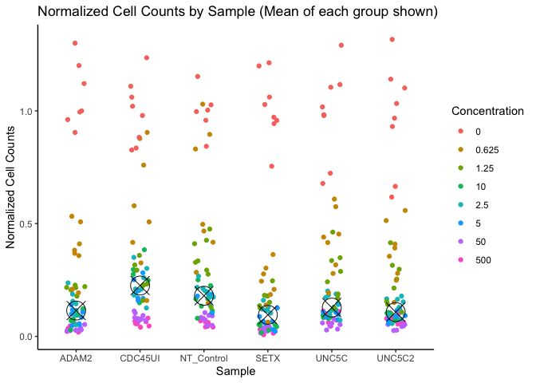<!-- -->

``` r
# box plot with normalized cell numbers and median values plotted
ggplot(normalize.df, aes(x=Sample, y=normalized, fill = Sample)) +
  geom_boxplot() +
  xlab("Sample") +
  ylab("Normalized Cell Counts") +
  ggtitle("Normalized Cell Counts by Sample") +
  labs(colour="Concentration") +
  theme_classic()
```

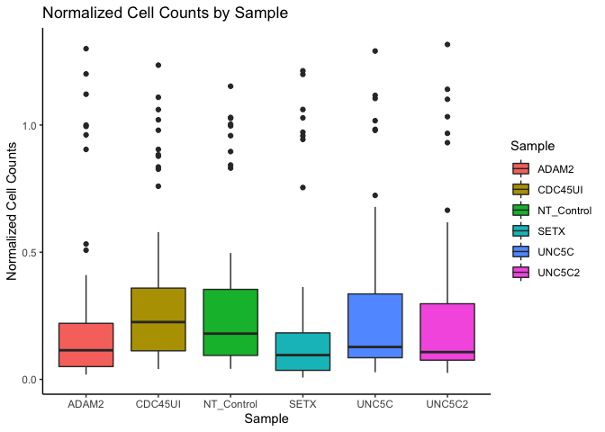<!-- -->

# Transformed Data

### Transform only Normalized Counts to address ANOVA assumptions

### There now appears evidence of normal distributions with more similar variance

### but a Welch’s ANOVA would be most appropriate (control for not equal variance)

``` r
# strip plot with normalized cell numbers and median values plotted
stripPlot2 <- ggplot(normalize.df, aes(x=Sample, y=log(normalized), color=as.character(Concentration))) +
  geom_jitter(height = 0, width = 0.15) +
  xlab("Sample") +
  ylab("Normalized Cell Counts") +
  ggtitle("log(Normalized) Cell Counts by Sample (Mean of each group shown)") +
  labs(colour="Concentration")

stripPlot2 + stat_summary(fun.y=median, geom="point", shape=13, size=8, color="black") + theme_classic()
#> Warning: `fun.y` is deprecated. Use `fun` instead.
```

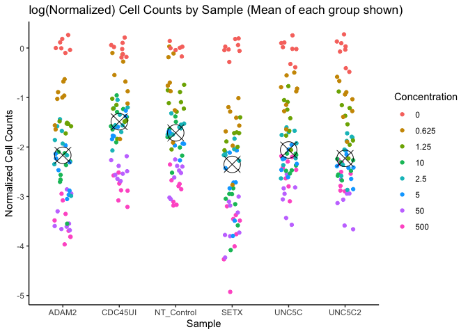<!-- -->

``` r
# box plot with normalized cell numbers and median values plotted
ggplot(normalize.df, aes(x=Sample, y=log(normalized), fill = Sample)) +
  geom_boxplot() +
  xlab("Sample") +
  ylab("Normalized Cell Counts") +
  ggtitle("log(Normalized) Cell Counts by Sample") +
  labs(colour="Concentration") +
  theme_classic()
```

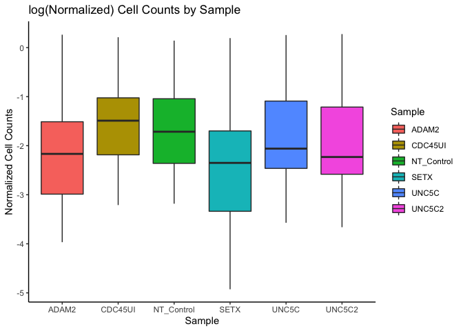<!-- -->

## Run test to check if transformed data has equal variance

### A Welch’s ANOVA may be most appropriate (p-value = 0.03816).

``` r
# Run test to check for equal variance (p-value = 0.03816).
# We can reject the null hypothesis that each group mean has equal variance.
bartlett.test(log(normalized) ~ Sample, data = normalize.df)
#> 
#>  Bartlett test of homogeneity of variances
#> 
#> data:  log(normalized) by Sample
#> Bartlett's K-squared = 11.764, df = 5, p-value = 0.03816
```

# ANOVA

## There is strong evidence to suggest that the mean of each sample is different (p-value = 5.74e-05)

``` r
# run an anova to determine if any of the group means is different
model <- aov(log(normalized) ~ Sample, data = normalize.df)
summary(model)
#>              Df Sum Sq Mean Sq F value   Pr(>F)    
#> Sample        5   30.8   6.160   5.582 5.74e-05 ***
#> Residuals   358  395.1   1.104                     
#> ---
#> Signif. codes:  0 '***' 0.001 '**' 0.01 '*' 0.05 '.' 0.1 ' ' 1

# pool the variance and run Welch's ANOVA
oneway.test(log(normalized) ~ Sample, data = normalize.df, var.equal = FALSE)
#> 
#>  One-way analysis of means (not assuming equal variances)
#> 
#> data:  log(normalized) and Sample
#> F = 5.0055, num df = 5.00, denom df = 166.67, p-value = 0.0002679
```

# Dunnette’s Multiple Comparison Adjustment

``` r
# determine which means are different between control and each group
DunnettTest(x = log(normalize.df$normalized), g = as.factor(normalize.df$Sample), control = "CDC45UI")
#> 
#>   Dunnett's test for comparing several treatments with a control :  
#>     95% family-wise confidence level
#> 
#> $CDC45UI
#>                          diff     lwr.ci     upr.ci    pval    
#> ADAM2-CDC45UI      -0.6293916 -1.1095098 -0.1492733  0.0047 ** 
#> NT_Control-CDC45UI -0.1441458 -0.6262603  0.3379688  0.9115    
#> SETX-CDC45UI       -0.8693217 -1.3514363 -0.3872072 3.6e-05 ***
#> UNC5C-CDC45UI      -0.2899419 -0.7700602  0.1901763  0.4065    
#> UNC5C2-CDC45UI     -0.3990003 -0.8791186  0.0811179  0.1386    
#> 
#> ---
#> Signif. codes:  0 '***' 0.001 '**' 0.01 '*' 0.05 '.' 0.1 ' ' 1
```

# Two Way ANOVA

``` r
# fit model with interaction (non-addative model)
model.fit <- aov(log(normalized)~Sample+Concentration+Sample:Concentration, data=normalize.df)
summary(model.fit)
#>                       Df Sum Sq Mean Sq F value   Pr(>F)    
#> Sample                 5  30.80    6.16   7.253 1.76e-06 ***
#> Concentration          1  90.41   90.41 106.457  < 2e-16 ***
#> Sample:Concentration   5   5.71    1.14   1.344    0.245    
#> Residuals            352 298.95    0.85                     
#> ---
#> Signif. codes:  0 '***' 0.001 '**' 0.01 '*' 0.05 '.' 0.1 ' ' 1
par(mfrow=c(1,2))
plot(model.fit$fitted.values,model.fit$residuals,ylab="Resdiduals",xlab="Fitted")
qqnorm(model.fit$residuals)
```

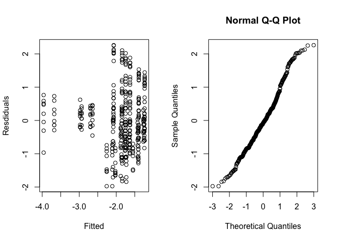<!-- -->

``` r
# fit model without interaction (additive model)
model.fit2 <- aov(log(normalized)~Sample+Concentration, data=normalize.df)
summary(model.fit2)
#>                Df Sum Sq Mean Sq F value   Pr(>F)    
#> Sample          5  30.80    6.16   7.218 1.87e-06 ***
#> Concentration   1  90.41   90.41 105.947  < 2e-16 ***
#> Residuals     357 304.66    0.85                     
#> ---
#> Signif. codes:  0 '***' 0.001 '**' 0.01 '*' 0.05 '.' 0.1 ' ' 1
par(mfrow=c(1,2))
plot(model.fit2$fitted.values,model.fit2$residuals,ylab="Resdiduals",xlab="Fitted")
qqnorm(model.fit2$residuals)
```

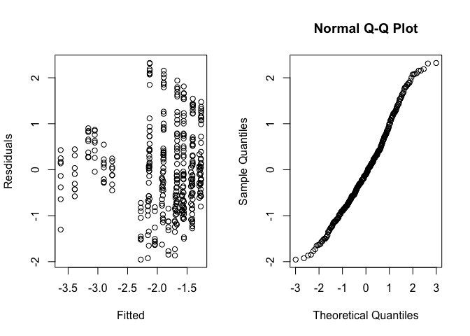<!-- -->

``` r
# make a marginal histogram to show density of points
# histogram to be plotted
# y_hist <- ggplot(normalize.df, aes(x=normalized, fill = as.character(Concentration))) +
#   geom_density(alpha = 0.4, size = 0.1) +
#   guides(fill = "none") +
#   theme_void() +
#   theme(plot.margin = margin()) +
#   coord_flip()

# Align histograms with scatterplot
# aligned_y_hist <- align_plots(y_hist, plot, align = "h", axis = "tb")[[1]]

# Arrange plots
# plot_grid(plot2
#   , aligned_y_hist
#   , ncol = 2
#   , rel_heights = c(0.2, 1)
#   , rel_widths = c(1, 0.2)
# )
```

# Linear Regression Model

## Un-transformed Assumptions

### There appears evidence of right skew for untransformed data

### There also appears evidence of unequal variance.

``` r
boxPlot <- ggplot(normalize.df, aes(x=as.factor(Concentration), y=normalized, color=Sample)) +
  geom_boxplot() +
  xlab("Concentration") +
  ylab("Normalized Cell Counts") +
  ggtitle("Normalized Cell Counts by Concentration (Mean for each group shown") +
  labs(colour="Sample")

boxPlot + stat_summary(fun.y=mean, geom="point", shape=13, size=8, alpha = 0.6, color="black") + theme_classic()
#> Warning: `fun.y` is deprecated. Use `fun` instead.
```

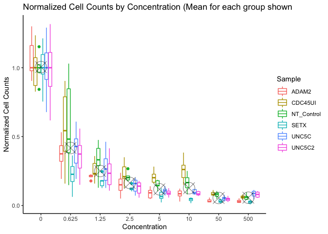<!-- -->

``` r
scatterPlot <- ggplot(normalize.df, aes(x=as.factor(Concentration), y=normalized, color=Sample)) +
  geom_jitter(height = 0, width = 0.15) +
  xlab("Concentration") +
  ylab("Normalized Cell Counts") +
  ggtitle("Normalized Cell Counts by Concentration (Mean for each group shown") +
  labs(colour="Sample")

scatterPlot + stat_summary(fun.y=mean, geom="point", shape=13, size=8, color="black") + theme_classic()
#> Warning: `fun.y` is deprecated. Use `fun` instead.
```

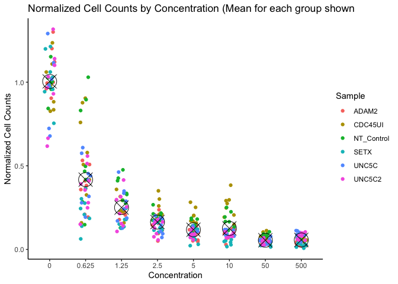<!-- -->

## Transformed Assumptions

### There now appears evidence of more normal distributions with more equal standard deviations.

``` r
scatterPlot2 <- ggplot(normalize.df, aes(x=as.factor(Concentration), y=log(normalized), color=Sample)) +
  geom_jitter(height = 0, width = 0.15) +
  xlab("Concentration") +
  ylab("Normalized Cell Counts") +
  ggtitle("Normalized Cell Counts by Concentration (Mean for each group shown)") +
  labs(colour="Sample")

scatterPlot2 + stat_summary(fun.y=mean, geom="point", shape=13, size=8, color="black") + theme_classic()
#> Warning: `fun.y` is deprecated. Use `fun` instead.
```

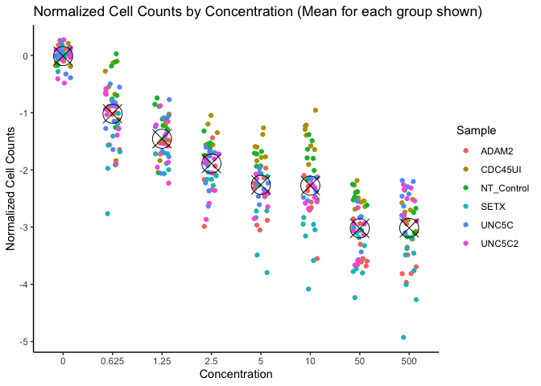<!-- -->

``` r
ggplot(normalize.df, aes(x=as.factor(Concentration), y=log(normalized), color=Sample)) +
  geom_jitter(height = 0, width = 0.15) +
  xlab("Concentration") +
  ylab("log(Normalized Cell Counts)") +
  ggtitle("Normalized Cell Counts by Concentration and Sample") +
  labs(colour="Sample") +
  facet_wrap(~Sample) +
  theme_classic()
```

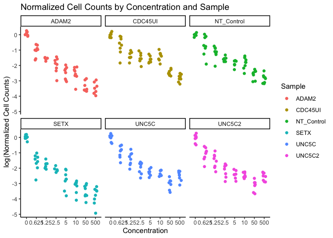<!-- -->

# LM model is also very powerful with this data. Need to determine how to handel -Inf before

# moving forward with this model

## Plot with Transformed Data to address Assumptions for LM model are met

``` r
normalize.df <- normalize.df %>% mutate(lConcentration = log(Concentration))
normalize.df$lConcentration[normalize.df$lConcentration == "-Inf"] <- -1

ggplot(normalize.df, aes(x=lConcentration, y=log(normalized), color=Sample)) +
  geom_jitter(height = 0, width = 0.15) +
  xlab("Concentration") +
  ylab("log(Normalized Cell Counts)") +
  ggtitle("Normalized Cell Counts by Concentration") +
  labs(colour="Sample") +
  theme_classic()
```

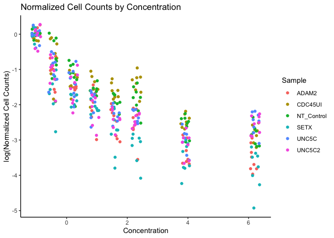<!-- -->

# Plot for Chris

``` r
normalize.df %>%
  mutate(Sample = fct_relevel(Sample, 
            "CDC45UI", "NT_Control", "ADAM2", 
            "SETX", "UNC5C")) %>%
  filter(Sample == "ADAM2" | Sample == "CDC45UI" | Sample == "NT_Control" | 
           Sample == "SETX" | Sample == "UNC5C") %>%
  ggplot(aes(x=Sample, y=normalized, color=Sample)) +
  geom_jitter(height = 0, width = 0.15) +
  xlab("Concentration") +
  ylab("Normalized Cell Counts") +
  ggtitle("Day 9 Normalized Cell Counts \n(+Auxin/-Auxin)") +
  labs(colour="Sample") +
  facet_wrap(~Concentration, scales = "free_x") +
  theme_classic() +
  theme(axis.text.x = element_blank(), axis.ticks = element_blank()) +
  stat_summary(fun.y=median, geom="point", shape=3, size=8, color="black")
#> Warning: `fun.y` is deprecated. Use `fun` instead.
```

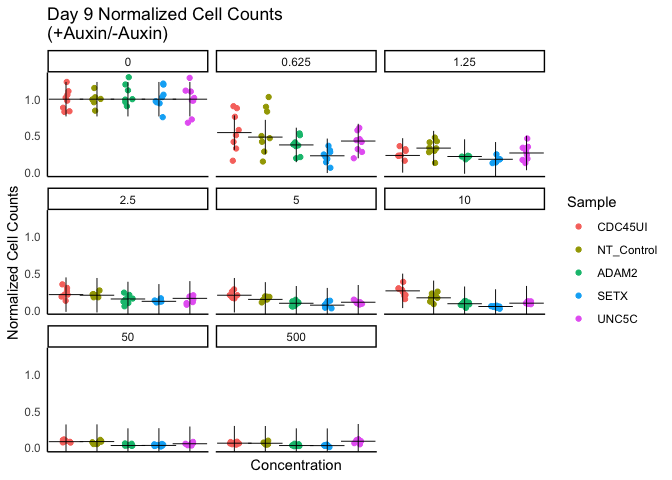<!-- -->

``` r
  
  #scale_x_discrete(labels=c("CDC45UI" = "Uninfected","NT_Control"="Nontargeting","ADAM2"="Adam2","SETX"="Setx", "UNC5C" = "Unc5c"))


#  ggplot(normalize.df, aes(x=Sample, y=normalized, color=Sample)) +
#    geom_jitter(height = 0, width = 0.15) +
#    xlab("Concentration") +
#    ylab("log(Normalized Cell Counts)") +
#    ggtitle("Normalized Cell Counts by Concentration and Sample") +
#    labs(colour="Sample") +
#    facet_wrap(~Concentration) +
#    theme_classic()
```
